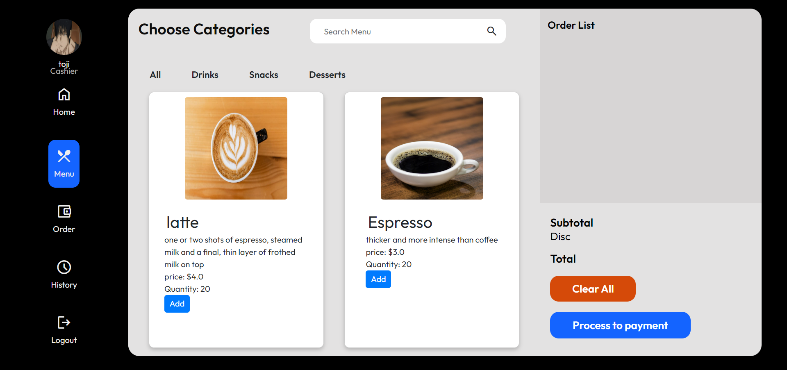
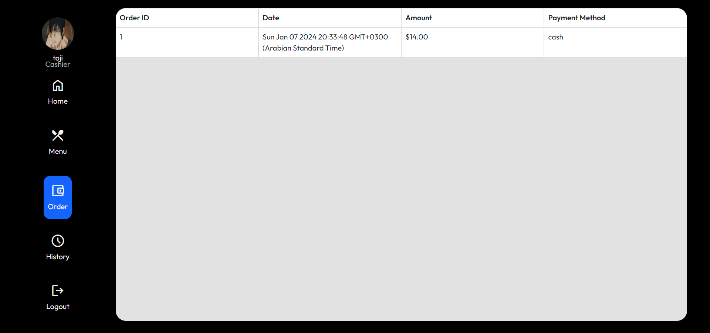
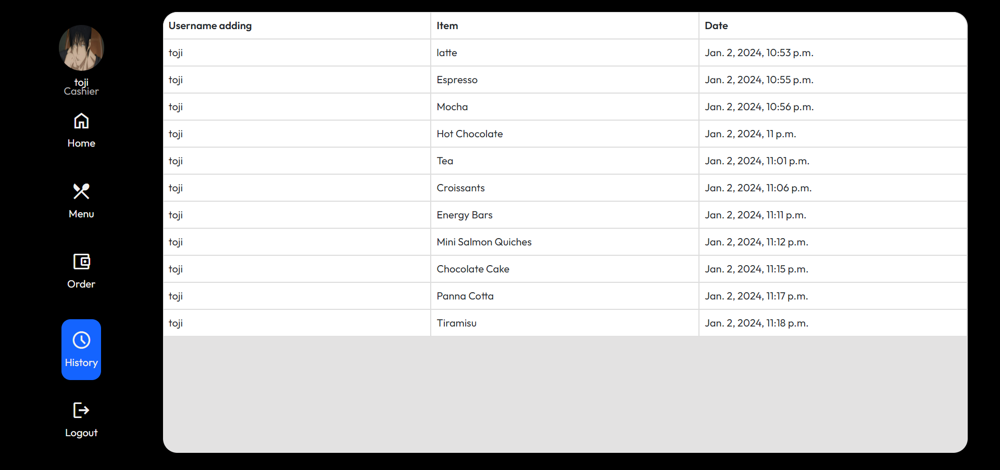
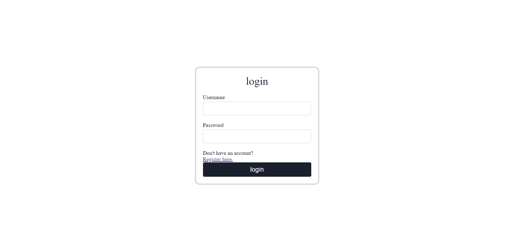
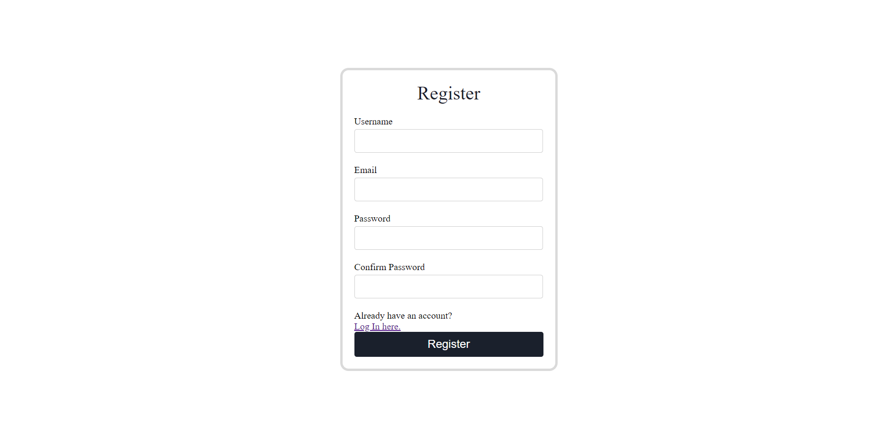

# Lattelink - Web50x Capstone Project
<br>

## Overview
<br>

Welcome to Lattelink, your go-to Point of Sale (POS) web application for seamless transactions, order management, and efficient cashier operations. Lattelink is designed with simplicity and functionality in mind, making it a versatile tool for businesses.

### Key Features

1. **Simplified Transactions:**
   - Lattelink streamlines the transaction process, allowing for quick and hassle-free customer orders. The intuitive interface ensures that both customers and cashiers can navigate with ease.

2. **Order Management:**
   - Efficiently manage orders through a user-friendly interface. The cashier can easily select items from the menu, add them to the order list, and complete the transaction process swiftly.

3. **Cashier-Exclusive Access:**
   - Ensure secure and authorized access with dedicated cashier-only functionalities. Cashiers can perform their tasks without unnecessary clutter, enhancing productivity.

4. **Menu Customization:**
   - Tailor your menu by adding different items with ease. Lattelink empowers businesses to adapt and modify their offerings according to changing preferences and seasons.

### How It Works

- **Customer Ordering:**
  - Customers can place orders for specific items, initiating the seamless transaction process.

- **Cashier Operations:**
  - Cashiers have exclusive access to manage orders, add items, and complete transactions efficiently.

- **Menu Customization:**
  - Businesses can easily customize the menu by adding or removing items, adapting to changing demands.

Whether you're a small cafe or a bustling restaurant, Lattelink is your trusted POS companion, combining functionality and simplicity for an enhanced customer and cashier experience.


## Justification

This project aligns with the expectations set forth in the CS50W final assignment, as it demonstrates the application of a variety of concepts and techniques covered in the course. The benefit of this project is to facilitate the sales process for customers and facilitate the user process when using this project. The whole application is based on the Django framework, which allowed managing user authentication, database models, http requests, static files and the page rendering. The Frontend part was made with django templates and javascript, which allowed to render the pages dynamically, and css, the application was made responsive.

The difference between this web application and previous projects is that this application is used to facilitate the selling process for customers, and it is easy and smooth in terms of use, and also easy in terms of the process of adding and deleting items, so the points of sale must provide the selling process easily and quickly, and it must be easy for the user who He sells through this application and manages it. With the possibility of including more features in the future regarding other services, such as the names of the people most requested from this application, the percentage of total people hired and promoted, the amount of items within the database, and more.

### Technical Foundation

The entire application is built on the Django framework, utilizing its robust features for managing user authentication, defining database models, handling HTTP requests, and serving static files.

The frontend of the application is crafted with a combination of HTML, CSS, and JavaScript, ensuring a responsive and dynamic user interface.

### Key Achievements

- [x] **Distinctiveness:**
  - Lattelink stands out from other projects in the course by incorporating unique features and functionalities. It is not based on the old CS50W Pizza project and is designed to be more complex than its counterparts.

- [x] **Django Integration:**
  - The backend is powered by Django, leveraging its capabilities for user authentication, database management (including at least one model), and efficient handling of HTTP requests.

- [x] **Frontend Dynamics:**
  - JavaScript plays a pivotal role in the frontend, enhancing user interactions and ensuring a seamless experience. The integration of JavaScript adds a layer of sophistication to the application.

- [x] **Mobile-Responsiveness:**
  - The web application is meticulously designed to be mobile-responsive, providing a consistent and user-friendly experience across various devices.

### Technologies Used

- **Django Framework:** for robust backend development.
- **HTML, CSS, and JS:** for creating an engaging and dynamic user interface.

In summary, Lattelink not only fulfills the specified project requirements but also goes beyond by offering a distinctive, complex, and well-integrated web platform.

## Structure
<br>

The web platform is structured as follows:

- app:- The main Django project files like ( settings.py, urls.py )
- lattelink:- The main Django app like ( templates, static, views.py, urls.py )
- media:- all Images on image fields in the database saved in this folder

## File Contents
<br>

## Front-End

---

### `templates`:

- `templates/layout.html`:
  - Base HTML template providing the overall structure and layout for the application. It serves as the foundation for other templates.
	

- `templates/index.html`:
  - HTML template for the main application page, displaying key information, features, or a dashboard. Customize this template to suit your specific application needs.
  
  
  
  


- `templates/login.html`:
  - HTML template for user login and signup functionality.
  

- `templates/register.html`:
  - HTML template for the user registration page.
  

### `static`:

- `static/index.js`:
  - JavaScript file containing client-side logic for dynamic interactions on the main application page (`index.html`). Consider detailing the specific functionalities and interactions handled by this script.
- `static/index2.js`:
  - JavaScript file containing client-side logic for dynamic interactions on the main application page (`index.html`). Consider detailing the specific functionalities and interactions handled by this script.

- `static/style.css`:
  - CSS file responsible for styling elements and ensuring a mobile-responsive design.

- `static/image`:
  - all Images on image fields in the database saved in this folder:
    - Chocolate_Cake.jpg
    - Croissants.jpg
    - cupcake.jpg
    - Energy_Bars.jpg
    - Espresso.jpg
    - Hot_Chocolate.jpg
    - latte.jpg
    - Mini_Salmon_Quiches.jpg
    - mocha.jpg
    - Panna_Cotta.jpg
    - tea.jpg
    - Tiramisu.jpg
    - toji.webp


## Back-End
-   -   -    
### Models in the app:
There are 3 models for the web application's database.
- `Category` - this model Hold the name of Category like Drink,Snack,Dessert.  
- `User`- this model Hold the name and image of the Cashier. 
- `Item`- this model Hold the name,image,description,price and the typr of category of the item in the menu .


### Manage.py file:

This file is used as a command-line utility and for deploying, debugging, or running the web application.This file contains code for runserver, makemigrations or migrations, etc. that we use in the shell. (Not changing anything here)


### Views and serializers py files:
'views.py' contains the funtions for the web application. These view functions sends and receives http request and response. They also combine with serializers to deal with model instances and querysets.


### init.py files:

This file is empty and remains that way. they are present only to tell that this particular directory is a package.


### admin.py files:
Similar to the name of the file, this file is used for registering the models into the django administration. The models that are present have a superuser/admin who can control the information that is being stored. (they are pre-built)


### apps.py files:
This file deals with the application configuration of the apps. The default configuration is sufficient enough in most of the cases.

### models.py files:
This file contains the models of our web application (classes). They are the blueprints of the database we are using and hence contain the information regarding attributes and the fields, etc of the database.

### test.py files:
 It is used to test the working of the application. (did not implement tests in this web application)

### urls.py files:
This file handles all the URLs of our Django web application. This file contains the lists of all the endpoints that we will have for our web application.

### views.py files:
These files are the crucial ones, it contains all the views. This file can be considered as the file that interacts with the client.

# Installation & how to run the application
Run the application in its default port (Django: 8000).

## Run
```
# Create a virtual environment:
python -m venv myenv

#For installing the requrirements:
pip install -r requirements.txt

# To run the project:
cd app
python manage.py runserver
```
